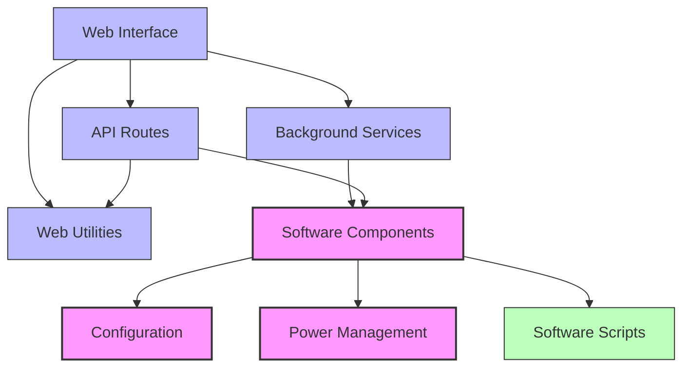

# CreatureBox Documentation

CreatureBox is a modular web interface for controlling and monitoring wildlife monitoring systems. This documentation provides comprehensive information about the system architecture, components, and usage.

## System Architecture

The CreatureBox system consists of several interconnected components:

## Quick Navigation

| Category | Components |
|----------|------------|
| **Setup** | [Installation](./root.md) · [Deployment](./deployment.md) |
| **Core Components** | [Configuration](./src-config.md) · [Power](./src-power.md) · [Software](./src-software.md) |
| **Web Interface** | [Web Core](./src-web.md) · [Routes](./src-web-routes.md) · [Services](./src-web-services.md) |
| **Development** | [Tests](./src-web-tests.md) · [Validation](./documentation-validation.md) |

## Key Features

- **System monitoring and control**: View system status, reboot, shutdown
- **Camera control**: Configure settings, take photos, calibrate
- **Photo gallery**: View, download, and delete photos
- **Scheduling**: Set up automatic photo schedules
- **Storage management**: Backups, cleanup, and monitoring
- **Background processing**: Async operations for long-running tasks
- **Caching**: Enhanced performance with local or Redis cache

## Documentation Overview

This documentation follows a structured approach to help you understand and use the CreatureBox system:

1. **Directory Documentation**: Each component has dedicated documentation describing its purpose, files, relationships, and use cases
2. **Architecture Overview**: High-level understanding of how components interact
3. **Technical Reference**: Detailed information about APIs, configurations, and functions
4. **Usage Examples**: Concrete examples of how to use the system

## Documentation Process

This documentation was generated through a systematic, recursive documentation process that:
1. Analyzes repository structure and code
2. Extracts relationships between components
3. Documents use cases and functionality
4. Validates completeness and accuracy

The documentation progress is tracked in the [Documentation Progress Tracking](./documentation-progress.json) file.

## Installation and Deployment

To set up CreatureBox, refer to:
- [Installation Guide](./root.md) - Base system installation
- [Deployment Configuration](./deployment.md) - Production deployment instructions