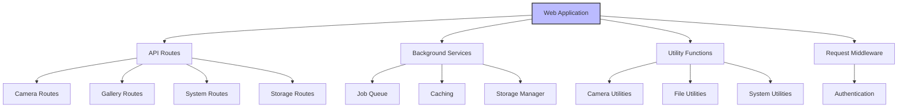

# Web Interface

The Web Interface is the primary user interaction component of the CreatureBox system. It provides a browser-based control panel for managing the wildlife monitoring system, viewing photos, configuring settings, and monitoring system status.

## Component Architecture

The Web Interface follows a modular architecture pattern:

## Key Components

  

    <h3>API Routes</h3>
    
Defines the REST API endpoints for controlling the system and accessing resources.

    

      <a href="./src-web-routes.html">Documentation</a>
    

  

  
  

    <h3>Background Services</h3>
    
Manages long-running tasks, caching, and storage operations.

    

      <a href="./src-web-services.html">Documentation</a>
    

  

  
  

    <h3>Middleware</h3>
    
Handles authentication, request processing, and cross-cutting concerns.

    

      <a href="./src-web-middleware.html">Documentation</a>
    

  

  
  

    <h3>Utilities</h3>
    
Provides reusable helper functions for camera, file, and system operations.

    

      <a href="./src-web-utils.html">Documentation</a>
    

  

  
  

    <h3>Tests</h3>
    
Comprehensive test suite for web components.

    

      <a href="./src-web-tests.html">Documentation</a>
    

  

## API Endpoints

The Web Interface exposes the following main API endpoints:

| Endpoint | Description | Documentation |
|----------|-------------|---------------|
| `/api/system/*` | System status and control | [System Routes](./src-web-routes.html#system) |
| `/api/camera/*` | Camera control and settings | [Camera Routes](./src-web-routes.html#camera) |
| `/api/gallery/*` | Photo gallery management | [Gallery Routes](./src-web-routes.html#gallery) |
| `/api/storage/*` | Storage management | [Storage Routes](./src-web-routes.html#storage) |
| `/api/jobs/*` | Background job management | [Job Routes](./src-web-routes.html#jobs) |

## Configuration

The Web Interface is configured through several mechanisms:

1. **Environment Variables**: Runtime configuration
2. **Config Files**: Settings in `src/config/` directory
3. **Web Settings**: User-configurable settings accessible through the interface

See [Configuration Documentation](./src-config.html) for more details.

## Core Files

The main web application is defined in these key files:

app.py - Application entry point and factory 
config.py - Configuration management 
error_handlers.py - Centralized error handling 
middleware.py - Request processing middleware

See [Web Core Documentation](./src-web.html) for detailed information about these files.

## Deployment

For production deployment, the Web Interface is deployed using:

- **Gunicorn**: WSGI server
- **Nginx**: Web server and reverse proxy
- **Systemd**: Service management

See [Deployment Documentation](./deployment.html) for configuration details.